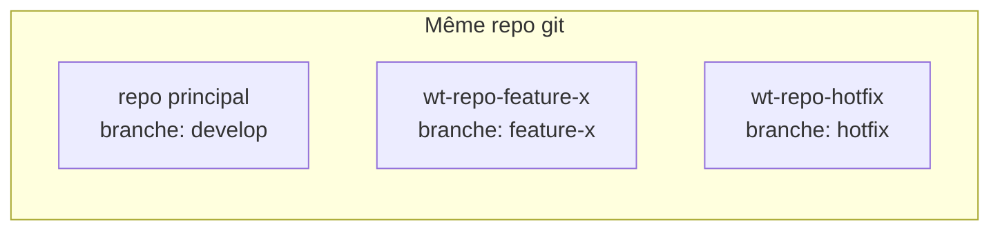
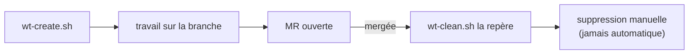

# Worktree Manager

Petit outil autonome pour gérer les git worktrees au quotidien : création à la demande, et
repérage de ceux dont la MR GitLab est mergée (donc nettoyables). Marche sur n'importe quel
repo git.

## Un worktree, c'est quoi

Un repo classique = un dossier = une branche à la fois. Un `git worktree` ajoute un **deuxième
dossier** sur le **même repo**, avec sa propre branche checkoutée — pas de clone, pas de
`.git` en plus.



**Avantages**
- Plusieurs branches en parallèle, chacune dans son dossier, sans stash/checkout.
- Environnement isolé par tâche.
- Traiter une urgence sans toucher au travail en cours ailleurs.

**Inconvénients**
- Duplique tout ce qui n'est pas versionné (`node_modules`, `vendor`, `.env`) → un nouveau
  worktree ne les a pas, et `npm ci`/`composer install` referaient tout le travail pour rien
  si le lockfile n'a pas changé (voir plus bas : `wt-create.sh` symlink au lieu de réinstaller).
- S'accumulent vite si non nettoyés une fois mergés.
- Deux worktrees du même projet lancés en même temps (containers) → collision de ports.

## Mon approche



Un worktree = une tâche = une branche, à côté du repo (`wt-<repo>-<branche>`). Jamais de
suppression sans vérifier d'abord que la MR est mergée.

## Ports et URLs

Le worktree isole le **code**, pas l'**environnement d'exécution**. Si le projet tourne en
containers, deux stacks du même projet lancées en même temps collisionnent sur les mêmes ports.

- Une seule stack à la fois par projet (arrêter l'autre avant de lancer).
- Besoin des deux en parallèle → offset manuel des ports dans la config du worktree.
- Reverse proxy déjà en place (Traefik...) → moins de souci, mais vérifier quand même.
- Toujours utiliser l'URL/port **du worktree où tu es**, pas celui du repo principal.

Un outil plus complet (voir plus bas) doit régler ça via des URLs propres par worktree, sans
gestion manuelle de ports.

## Installation

Prérequis : `python3`, et selon l'hébergeur du repo (auto-détecté sur l'URL du remote) :
`glab` authentifié pour GitLab, ou `gh` authentifié pour GitHub.

```bash
git clone https://github.com/techmefr/worktree-manager.git ~/.claude/skills/worktree-manager
chmod +x ~/.claude/skills/worktree-manager/scripts/*.sh ~/.claude/skills/worktree-manager/scripts/*.py
```

(Sans Claude Code : clone où tu veux, appelle les scripts par leur chemin.)

## Utilisation

**Créer un worktree :**
```bash
scripts/wt-create.sh <nom-branche> [chemin-du-repo] [branche-de-base]
```
Si `package-lock.json`/`composer.lock` sont identiques à ceux du repo principal, `node_modules`
et `vendor` sont symlinkés depuis le repo principal au lieu d'être réinstallés (rapide, et sans
risque tant qu'on ne touche pas aux dépendances). Sinon un message le signale : installe-les
normalement dans ce cas.

**Voir ce qui peut être nettoyé :**
```bash
scripts/wt-clean.sh [chemin-du-repo]
```
Marche sur GitLab et GitHub (détecte l'hébergeur via l'URL du remote). Affiche
`worktree | branche | statut MR/PR`. Pour une ligne `merged`, à la main :
```bash
git worktree remove <chemin>
git branch -D <branche>
```

**Vérification auto (Claude Code, optionnel) :**
```
/loop 45m /worktree-manager clean
```
La suppression reste toujours confirmée à la main.

## Et après ?

Outil volontairement simple. Un outil plus complet est prévu pour gérer les worktrees à
plusieurs : état partagé en base, dashboard visuel type Portainer, URLs propres par worktree.

## Contenu

- `SKILL.md` — instructions pour un agent Claude Code
- `scripts/wt-create.sh` / `wt-clean.sh` / `wt-mr-status.py`
